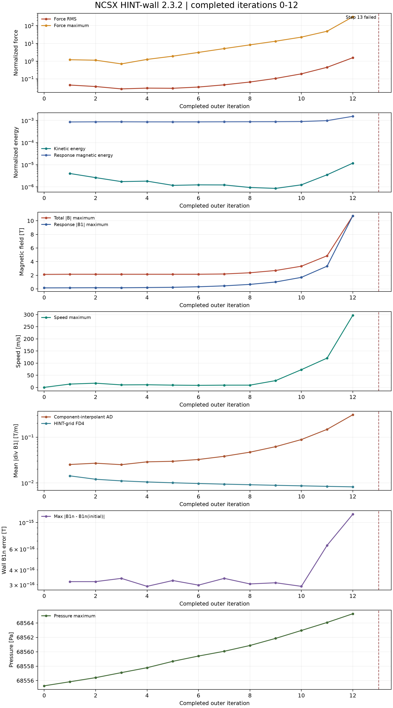

# NCSX: HINT-wall 2.3.2 / VMEC / Unscale / Component

本次运行**仅完成外迭代 1–12**。外迭代 13 的 Step-B 在第一壁 RK 阶段离散散度约束检查中止，未保存第 13 步结果。下图只使用第 0–12 步的完整 NetCDF 记录；不能把这些记录称作收敛平衡。

## 来源与设置

- 求解器：HINT-wall 2.3.2，源码提交 `8609e184e1d7b8bcabab662ddf1fb170243ded60`。
- `mode=initial`，`start_point=vmec`，`scale_after=false`，`magnetic_interpolation=component`。
- 柱坐标网格 144 x 144 x 144；原计划 50 个外迭代，每个 Step-B 1000 个内步；`kdivb=1e-4`，壁面增量相对容差 `1e-5`。
- 结果 NetCDF 的 SHA-256：`e3da036e255a1629e51d1dc8e67b6fcccbec2eb6f9beddee11e38bca9f1fc257`。大文件未上传，仅发布从该文件和运行进度日志提取的[逐步数值](Documents/docs-data/history_0_12.json)及[绘图与边界审计脚本](tools/plot_evolution.py)。

## 中止原因与演化趋势

运行日志最后报错：`first-wall RK-stage divergence constraint failed: residual/allowed=inf, wall_increment_relative_tolerance=1.000000e-05, iteration_budget=576; the step is rejected.` 这表示第 13 步某个 RK 阶段的第一壁离散散度约束未能满足，求解器拒绝该阶段并终止；`inf` 是该失败比值的报告值，并不是已证实的物理散度无穷大。第 13 步未保存完整场，不能从日志单独判定最先失效的数值算子。

中止前已有逐渐放大的迹象：最大总场从第 8 步的 2.362 T 增至第 12 步的 10.726 T；最大流速从 9.11 增至 297.03 m/s；归一化力残差 RMS 从 0.0662 增至 1.5544。第 12 步最强场点距第一壁约 4.0 mm；距壁超过 5 cm 的区域最大场约 2.42 T。这说明异常主要集中在近壁区域。其发展与**演化逐渐失稳**相符，**数值不稳定**是可能原因，但目前不能据此断定初始触发机制，也不能证明发生了真实物理 MHD 不稳定。

磁场散度指标须区分定义：响应场的分量插值器自动微分平均绝对散度从第 1 步约 0.0253 增至第 12 步约 0.3081 T/m；HINT 网格四阶差分平均绝对散度同期从约 0.0143 降至 0.00822 T/m。两种离散诊断并不等价，不能笼统地说全局 FD4 散度也在增长。报错本身是第一壁 RK 阶段的约束检查，不能直接等同于上述任一全域平均值。

## 第一壁法向场

`vmec` 启动冻结的是**非零的初始响应场** `B1·n`，并非要求总场或响应场在壁上为零。对第 0–12 步保存的原始响应场，在 72,930 个壁面采样位置直接重建 `B1·n`，不重新施加边界条件：初始 `max|B1·n|=0.0717937951 T`；全程 `max|B1·n(t)-B1·n(0)|=1.1744e-15 T`，第 12 步误差 RMS 为 `4.80e-17 T`。因此已保存步数中的冻结法向场保持到接近浮点精度。它不能保证壁面切向场、近壁力残差或第 13 步阶段状态稳定。

[查看实例网页](index.html)。不发布原始 NetCDF、wout、mgrid、缓存或凭据。
